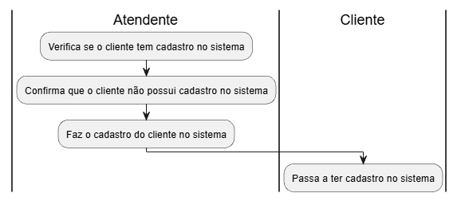
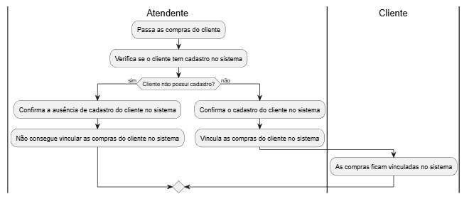
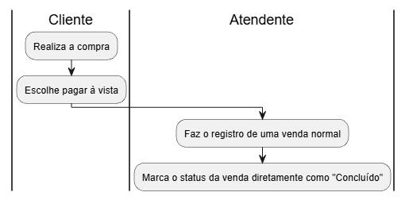
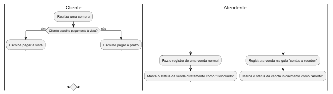

# Avaliação — Engenharia de Software
**Sistema Integrado de Gestão de Farmácia — MVP Definido pelo Estudante**

Aluno: Gabriel da Silva Freitas 
RA: 24001078
Data: 26/03/2026 

---

# 1. Definição do MVP
Descreva aqui **qual parte do sistema** foi incluída no seu MVP.  
Explique claramente:

- O que está **dentro** do MVP  
- O que está **fora** do MVP  
- Por que você fez essas escolhas  

> Esse MVP cobre o processo de venda desde a identificação do cliente até o registro da venda em si. Ele não detalha os processos relacionados à parte financeira e geração de relatórios. A escolha desse processo específico se deve às possibilidades enormes de análise e levantamento dos processos envolvidos na venda de produtos, registro em estoque e cadastro de clientes 

---

# 2. Regras de Negócio (mínimo: 5)
Liste e descreva **cada RN** de forma clara.

**RN01 — Condição mínima de venda de um produto**

- Cada produto a ser vendido não pode estar vazio no estoque  

**RN02 — Permissões de gerente**

- Apenas gerentes podem cadastrar novos produtos, aprovar preços e atualizar informações do estoque

**RN03 — Permissões do setor financeiro**

- O setor financeiro deve ser capaz de consultar facilmente lançamentos em aberto, atrasados e pagos, além de gerar relatórios

**RN04 — Permissões de atendente**

- O atendente poderá apenas registrar vendas, consultar produtos e identificar clientes

**RN05 — Permissões de farmacêutico**

- O farmacêutico poderá apenas validar receitas e autorizar vendas controladas

**RN06 — Permissões de administrador**

- O administrador poderá apenas administrar usuários, permissões e parâmetros gerais

---

# 3. Requisitos Funcionais (mínimo: 8)
Liste os requisitos funcionais do seu MVP.

**RF01 — Verificação de quantidade mínima do produto no estoque**  

- O sistema deve verificar e alertar quando um produto estiver com a sua quantidade abaixo da quantidade mínima

**RF02 — Cadastro de cliente no sistema**

- O sistema deve permitir ao atendente registrar um cliente no sistema caso este não possua cadastro

**RF03 — Registro de compras em contas a receber**

- O sistema deve permitir ao atendente registrar compras à prazo ou de convênios na guia de "contas a receber", informando a descrição, valor, data de vencimento, data de recebimento e status (Aberta, Fechada ou Atrasada)

**RF04 — Registro de pagamentos em contas a pagar**

- O sistema deve permitir ao atendente registrar pagamentos de fornecedores, despesas da unidade e impostos e serviços na guia "contas a pagar", informando descrição, valor, data de vencimento, data de pagamento e status (Aberta, Fechada ou Atrasada)

**RF05 — Atualização de estoque**

- O sistema deve atualizar o estoque automaticamente após qualquer registro de venda, devolução, perda, transferência, reposição pós compra e compras feitas aos fornecedores
  
**RF06 —**  
**RF07 —**  
**RF08 —**

(Adicione mais se quiser.)

---

# 🛡 4. Requisitos Não Funcionais (mínimo: 4)
Liste os RNFs do sistema conforme seu MVP.

**RNF01 — Integridade de produtos no estoque**

- O sistema deve garantir que cada produto disponível esteja com suas quantidades exatas no estoque

**RNF02 — Tempo de resposta**

- O sistema deve realizar os processos de venda e cadastro de clientes em  até 2s

**RNF03 —**  
**RNF04 —**  

(Adicione mais se quiser.)

---

# 5. Casos de Uso (mínimo: 10)
### Inserir **diagrama de casos de uso geral**, demonstrando claramente:
- os 10 casos
- relação entre eles e atores
- pelo menos 3 includes
- pelo menos 3 extends

---

# 6. Documentação dos Casos de Uso
Para **cada caso de uso**, utilize o template abaixo:
---

## **UC01 — Cadastro de cliente no sistema**
**Ator(es):**

- Atendente
- Cliente

**Descrição:**

- Cadastro de clientes no sistema pelo atendente

**Pós-condições:**  

- O Cliente possui cadastro no sistema

### Fluxo Principal
1. O atendente verifica se o cliente tem cadastro no sistema
2. O atendente confirma que o cliente não possui cadastro no sistema
3. O atendente faz o cadastro do cliente no sistema
4. O cliente passa a ter cadastro no sistema
 

### Relacionamentos 
- **Extend:** UC02 — Vincular compras ao histórico 

### Inserir o diagrama de atividades do Caso de Uso, demonstrando tudo o fluxo princial e alternativos/exceções.

---

## **UC02 — Vincular compras ao histórico**
**Ator(es):**

- Atendente
- Cliente

**Descrição:**

- Vinculação das compras ao histórico do cliente

**Pré-condições:**

- O cliente deve ter cadastro com o sistema

**Pós-condições:**

- As compras realizadas pelo cliente são vinculadas ao seu histórico no sistema

### Fluxo Principal
1. O atendente passa as compras do cliente
2. O atendente verifica se o cliente tem cadastro no sistema 
3. O atendente confirma o cadastro do cliente no sistema
3. O atendente vincula as compras do cliente no sistema
4. As compras do cliente ficam vinculadas ao sistema
  

### Fluxos Alternativos / Exceções
- **FA01 —  O cliente não possui cadastro**

    1. O atendente verifica se o cliente tem cadastro no sistema
    2. O atendente confirma que o cliente não tem cadastro no sistema
    3. O atendente não consegue vincular as compras do cliente ao sistema
  

### Inserir o diagrama de atividades do Caso de Uso, demonstrando tudo o fluxo princial e alternativos/exceções.

---

## **UC03 — Registrar compras**
**Ator(es):**

- Atendente
- Cliente

**Descrição:**

- Registro de compras no sistema pelo atendente

**Pré-condições:**

- O cliente deve ter realizado uma compra

**Pós-condições:**  

- Compra registrada como finalizada

### Fluxo Principal
1. O cliente realiza uma compra
2. O cliente escolhe pagar à vista
3. O atendente faz o registro de uma venda normal
4. O atendente marca o status da venda diretamente como "Concluído" 
  

### Relacionamentos  
- **Extend:** UC04 — Registro de compras à prazo 

### Inserir o diagrama de atividades do Caso de Uso, demonstrando tudo o fluxo princial e alternativos/exceções.

---

## **UC04 — Registro de compras à prazo**
**Ator(es):**

- Atendente
- Cliente

**Descrição:**

- Registro de compras à prazo ou de convênios na guia "contas a receber"

**Pré-condições:**

- O cliente deve ter realizado uma compra

**Pós-condições:**  

- Compra registrada na guia "contas a receber"
- Status marcado inicialmente como "Aberto"

### Fluxo Principal
1. O cliente realiza uma compra
2. O cliente escolhe pagar à prazo 
3. O atendente registra a venda na guia "contas a receber"
4. O atendente marca o status da venda inicialmente como "Aberto"

### Fluxos Alternativos / Exceções
- **FA01 — Cliente escolhe pagamento à vista**
    1. O cliente realiza uma compra
    2. O cliente escolhe pagar à vista
    3. O atendente faz o registro de uma venda normal
    4. O atendente marca o status da venda diretamente como "Concluído"
   

### Inserir o diagrama de atividades do Caso de Uso, demonstrando tudo o fluxo princial e alternativos/exceções.

---

## **UCXX — Nome do Caso de Uso**
**Ator(es):**  
**Descrição:**  
**Pré-condições:**  
**Pós-condições:**  

### Fluxo Principal
1.  
2.  
3.  
4.  

### Fluxos Alternativos / Exceções
- FA01 —  
- FA02 —  

### Relacionamentos
- **Include:** (listar quando aplicável)  
- **Extend:** (listar quando aplicável)  

### Inserir o diagrama de atividades do Caso de Uso, demonstrando tudo o fluxo princial e alternativos/exceções.

---

## **UCXX — Nome do Caso de Uso**
**Ator(es):**  
**Descrição:**  
**Pré-condições:**  
**Pós-condições:**  

### Fluxo Principal
1.  
2.  
3.  
4.  

### Fluxos Alternativos / Exceções
- FA01 —  
- FA02 —  

### Relacionamentos
- **Include:** (listar quando aplicável)  
- **Extend:** (listar quando aplicável)  

### Inserir o diagrama de atividades do Caso de Uso, demonstrando tudo o fluxo princial e alternativos/exceções.

---

## **UCXX — Nome do Caso de Uso**
**Ator(es):**  
**Descrição:**  
**Pré-condições:**  
**Pós-condições:**  

### Fluxo Principal
1.  
2.  
3.  
4.  

### Fluxos Alternativos / Exceções
- FA01 —  
- FA02 —  

### Relacionamentos
- **Include:** (listar quando aplicável)  
- **Extend:** (listar quando aplicável)  

### Inserir o diagrama de atividades do Caso de Uso, demonstrando tudo o fluxo princial e alternativos/exceções.

---

## **UCXX — Nome do Caso de Uso**
**Ator(es):**  
**Descrição:**  
**Pré-condições:**  
**Pós-condições:**  

### Fluxo Principal
1.  
2.  
3.  
4.  

### Fluxos Alternativos / Exceções
- FA01 —  
- FA02 —  

### Relacionamentos
- **Include:** (listar quando aplicável)  
- **Extend:** (listar quando aplicável)  

### Inserir o diagrama de atividades do Caso de Uso, demonstrando tudo o fluxo princial e alternativos/exceções.

---

## **UCXX — Nome do Caso de Uso**
**Ator(es):**  
**Descrição:**  
**Pré-condições:**  
**Pós-condições:**  

### Fluxo Principal
1.  
2.  
3.  
4.  

### Fluxos Alternativos / Exceções
- FA01 —  
- FA02 —  

### Relacionamentos
- **Include:** (listar quando aplicável)  
- **Extend:** (listar quando aplicável)  

### Inserir o diagrama de atividades do Caso de Uso, demonstrando tudo o fluxo princial e alternativos/exceções.

---

## **UCXX — Nome do Caso de Uso**
**Ator(es):**  
**Descrição:**  
**Pré-condições:**  
**Pós-condições:**  

### Fluxo Principal
1.  
2.  
3.  
4.  

### Fluxos Alternativos / Exceções
- FA01 —  
- FA02 —  

### Relacionamentos
- **Include:** (listar quando aplicável)  
- **Extend:** (listar quando aplicável)  

### Inserir o diagrama de atividades do Caso de Uso, demonstrando tudo o fluxo princial e alternativos/exceções.

---
> Repita essa estrutura para **todos os seus casos de uso** (mínimo 10).

